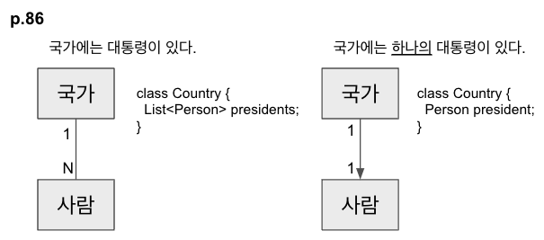
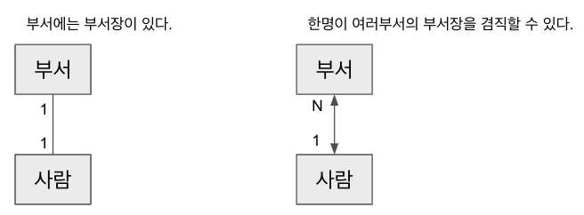
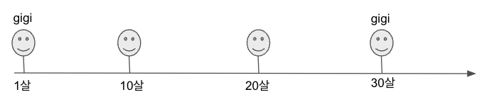
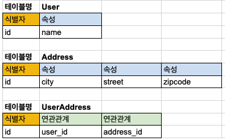
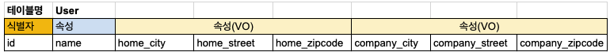

# 5장 소프트웨어에서 표현되는 모델


## 연관관계


### 연관 관계 설계를 도와주는 방법

1. 탐색 방향을 부여한다.
2. 한정자를 추가하여 다중성을 줄인다.
3. 중요하지 않은 연관관계를 제거한다.

= > 불필요한 의존성을 줄이고 설계를 단순화할 수 있도록 관계를 제약하는 것이 중요하다.


### 연관관계 설계


**예제 1)**



“대통령” 유비쿼터스 언어에 포함된 규칙 :  `한 사람이 여러 국가의 대통령이 될 수 없다.`

=> 암시적으로 포함된 규칙을 명시적으로 모델에 드러내고 도메인 전문가와 함께 설계, 검토해야 함

__Q. 위 모델링에서 "대통령" 에 대한 도메인이 별도 정의되어야 하지 않을까?__


**예제 1-1)**

연관관계에 대한 도메인 규칙은 쉽게 단언할 수 없다.




**Q. 제약조건은 연관관계를 명확하게 하고 프로그램이 의도된 방향으로 동작될 수 있도록 해준다. 하지만, 유지보수를 쉽게 해주는가?**


---


## Entity

연속성과 식별성

#### 연속성

- 생명주기 내내 이어지는 추상적인 연속성

#### 식별성

- 연속성을 유지할 수 있게 해주는 정체성



사람의 식별자는 무엇일까?

- 주민등록번호(사회보장번호) ? 등록하지 않은 사람들, 변경하는 사람들
- DNA ? 일란성 쌍둥이, 유전자 가위로 형질 변경
- 지문 ? 변형
- 홍채 ? 10억분의 1로 같을 수 있음

=> 생명주기 내내 변경되지 않을 식별자를 선택하는 것은 중요하다.
식별자라고 생각했지만, 속성일수도 있다.
객체의 속성으로 객체의 일치 여부를 판단하는 요구사항에 주의해야한다.


###  Entity 모델링

**식별성**

- 유일성과 동일성을 보장할 정체성
  - 인조키
    - 최근 트랜드는 대부분 인조키
    - 인덱스 구성의 이점
    - 시대와 환경이 변해도 불변   
  - 자연키
    - 왜 쓰는가? 
        - 키만 보고도 뜻하는 바를 알 수 있다. 
        - 다른 시스템간(넓은 범위에서는 회사 간 협업시) 데이터의 흐름을 잇는 매개체

**속성과 행위**

- **개념에 필수적인 행위만 추가하고 행위에 필요한 속성만 추가한다.** (=> 속성부터 추가하고 해당 속성으로 하는 행위를 정의하지 않는다.)
  - "조영호 - 객체지향의 사실과 오해" - "행동이 상태를 결정한다."
    - https://github.com/cheese10yun/TIL/blob/master/OOP/%EA%B0%9D%EC%B2%B4%EC%A7%80%ED%96%A5%EC%9D%98%EC%82%AC%EC%8B%A4%EA%B3%BC%EC%98%A4%ED%95%B4.md
  - TDD
    - TDD의 목적은 테스트 커버리지를 높이는 것 뿐만 아니라 요구사항을 충실이 반영하는 설계를 구현함에 있다.
    - https://www.youtube.com/watch?v=6Vt-wKPBbuc

=> 요구사항을 충족하기 위해 해당 객체가 어떤 역할을 수행하고 협력할지에 집중하게 된다. 

---


## Value Object

### 특성

#### 식별성을 갖지 않으면서 도메인의 **응집력 있는** 서술적 측면을 나타내는 객체


다음 요구사항을 모델링 해보자

> 사용자 정보에는 이름이 있다.
>
> 주소는 city, street, zipcode 정보로 구성된다.
>
> 사용자는 여러개의 주소 정보를 가질 수 있다. 여러명의 사용자가 같은 주소를 가질 수 있다.


[첫번째 방법] User와 Address를 각각 Entity로 모델링하고, 이 둘 간의 연관관계(다대다)를 맵핑한다.

```java
@Entity
class User {

  	@Id
    @GeneratedValue(strategy = GenerationType.IDENTITY)
  	private Long id; // 식별자
  
    private String name; // 속성
  
    @OneToMany(mappedBy="user")
  	private List<UserAddress> userAddress; // 연관관계
}

@Entity
class Address {
  
    @Id
    @GeneratedValue(strategy = GenerationType.IDENTITY)
  	private Long id; // 식별자
  
    String city;
    String street;
    String zipcode;
   
    @ManyToOne(mappedBy="address")
  	private List<UserAddress> userAddress; // 연관관계
}
```




이런 복잡한 연관관계를 가질 만큼 Address가 식별성과 연속성이 필요한 모델일까?

**Address는 그 자체로 생명주기를 가지고, 중요한 책임을 수행하기 보다는 User를 서술하는 속성에 가깝다.**

Address를 Value Object로 모델링 해보자.

```java
@Entity
class User {

  	@Id
    @GeneratedValue(strategy = GenerationType.IDENTITY)
  	private Long id; // 식별자
  
    private String name; // 속성

    @Embedded
    @AttributeOverrides(
        value = [
            AttributeOverride(name = "city", column = Column(name = "home_city")),
            AttributeOverride(name = "street", column = Column(name = "home_street")),
            AttributeOverride(name = "zipcode", column = Column(name = "home_zipcode"))
        ]
    )
    private Address homeAddress; // 속성

    @Embedded
    @AttributeOverrides(
        value = [
            AttributeOverride(name = "city", column = Column(name = "company_city")),
            AttributeOverride(name = "street", column = Column(name = "company_street")),
            AttributeOverride(name = "zipcode", column = Column(name = "company_zipcode"))]
    )
    private Address companyAddress; // 속성
}

// VO
@Embeddable
class Address {
    String city;
    String street;
    String zipcode;
  
   Address(...)
}
```

관계형 데이터베이스에서는 다음과 같이 Address가 역정규화되어 표현된다.




#### Value Object가 Entity를 참조할 수도 있다.

```java
class Route {
  Location departure;
  Location destination;
  
  public String getDepartureAddress(){
    return departure.getAddress()
  }
  
   public String getDestinationAddress(){
    return destination.getAddress()
  }
}

@Entity
class Location {
  @Id @GeneratedValue(strategy = GenerationType.IDENTITY)
  Long id;
  
  String name;  
}

class RouteTimeEstimator {
  
  public Long estimateRouteTime(Route route){
    String startLoc = route.getDepartureAddress();
    String endLoc = route.getDestinationAddress(); 
    return calculateTime(startLoc, endLoc);
  }
}

```


#### 여러 객체 간에 오가는 메시지의 매개변수로 사용할 수도 있다.

```java
public void doSomething(Any param1, Any param2, Any param3){...}

public void doSomething(Vo object){...}
```


### Value Object 설계

- 불변성 지키기
  - 특정 언어에서 불변성을 직접적으로 지원해주지 않는다면, 규칙을 유지하는 노력이 더 필요하다.
  - Java에서 컬렉션 타입에 대한 불변성을 지키기 위해서는 래퍼 클래스가 필요하다. kotlin은 불변 컬렉션을 기본으로 지원하여 별도 노력 없이 사용할 수 있다.
> 불변성의 장점
>
> - 공유되어도 side effect가 발생하지 않음
> - 캐싱하여 메모리를 절약할 수 있음. 
>   - ex) java.lang.Integer와 IntegerCache

>  VO와 DTO의 차이
>
>  - VO : 비즈니스적인 의미를 갖는 객체
>
>  - DTO : Domain Model에 영향을 주지 않고 Presentation Layer와의 데이터 송수신을 위해 정의하는 객체
>
>  [참고] [VO(Value Object) vs DTO(Data Transfer Object)](https://gmlwjd9405.github.io/2018/12/25/difference-dao-dto-entity.html)

---


## Service

- Entity나 Object Value 고유의 책임이 아니라면 Service로 선언되는 독립 인터페이스로 모델에 추가하라.
- 유비쿼터스 언어의 일부가 되게끔 구성하다
- 상태를 갖지 않게 만들어라. (객체와 달리 행위에 영향을 줄 수 있는 상태를 갖지 않는다.)


#### 여러 계층에 존재하는 Service 구분

- 응용
  - 입력 내용의 암호화
  - 비즈니스 로직 수행을 위한 도메인 서비스로의 메시지 전송
  - 프로그램 흐름 제어
  - 인프라스트럽처 서비스를 이용한 통지 결정
  - 다른 모듈로 이벤트 발행
  - 모델을 DTO로 변환하여 presentation layer로 반환
- 도메인
  - 여러개의 Entity, Value Object의 상호작용이 필요한 행위를 제공
- 인프라스트럭처
  - 애플리케이션에서 지정한 곳으로 이메일이나 우편 등을 보냄


#### 적절한 구성 단위

구성단위가 중간 크기인 무상태 Service는 대형 시스템에서 재사용하기 쉽다.

- 중요한 기능을 캡슐화
- 컴포넌트를 패키지화 하는데 매우 유용한 중간 구성 단위의 기능을 제공

> 구성 단위가 세밀한 도메인 객체는 도메인에서 지식이 새어 나오게 해서 도메인 객체의 행위를 조정하는 응용 게층으로 들러가게 할 수 있다.
>
> 상호작용의 복잡성이 응용계층에서 처리되고, 도메인 게층에서 사라진 도메인 지식이 응용 계층이나 사용자 인터페이스 계층의 코드로 스며든다.


---


## Module

- 모듈 간에는 결합도가 낮아야 하고 모듈 내부는 응집도가 높아야 한다.
- 모듈로 쪼개지는 것은 코드가 아닌 **개념**이다.
- **유비쿼터스 언어**를 구성하는 것으로 모듈의 이름을 부여하라. 모듈의 이름은 도메인에 통찰력을 줄 수 있어야 한다.


#### 모듈화의 이점

- 인지적 과부화 해소
  - 모듈에 들어있는 세부 사항을 배제한 상태에서 모듈 간의 관계를 이해할 수 있음
  - 해당 모듈 내에 한하여 모델을 이해할 수 있음
- 작은 단위의 시스템 분리로 느슨한 결합
- 큰 단위에서 모듈화는 MSA 단위가 될 수 있고 "비즈니스 경계 분리", "모듈별 가장 적합한 기술 스택을 적용", "유지보수, 배포 효율화" 등의 이점을 가져 보다 견고하고 계속해서 진화하는 시스템을 만들 수 있다.


#### 모듈 모델링 주의점

- 개념적 객체를 구현하는 요소가 서로 떨어져 있으면 더는 코드에서 모델이 드러나지 않는다.
- 기술 환경에 필수적이거나 실질적으로 개발에 도움이 되는 최소한의 분할 규칙만 선택
- 여러 서버에 코드를 분산하는 것이 의도한 바가 아니라면 하나의 개념적 객체를 구현하는 코드는 모두 같은 모듈 안에 둬야 한다.


#### 논리적 개념 기반 모듈화

[영화관 시스템]
- 매점 주문 모듈
- 표 예매 모듈
- 상영 영화 관리 모듈


### tier 기반 모듈화

- 공개 인터페이스 제공 계층 (presentation layer)
- 애플리케이션에 특화된 기능을 제공하는 게층 (application layer)
- **객체 고유의 행위를 처리하는 계층 (domain layer)**
- 데이터 영속화 계층 (infrastructure layer)


**Q. 논리적 개념 기반 모듈화 vs tier 기반 모듈화. 어떤 것을 선호하는가? 두가지를 함께 적용하는 건 어떤가?**


#### 인프라스트럭처(기술 프레임워크) 주도 패키지화의 함정

- 모듈 설계는 기술 프레임워크의 특성에 기인할 수 있다.

- 프레임워크의 규약에 따라 패키지화 하는 경우 논리적(개념적) 분리에 대한 집중 보다는 기술적인 모듈화를 하게 될 수 있다.

- 예시) 

  - p. 117 - J2EE의 관행
  - p.118 - 패키지 구조와 명명 규약이 강제되는 프레임워크

  

### 모델링 패러다임


#### 객체지향 패러다임이 지배적인 이유

- 대부분의 사람들도 자연스럽게 이해
  - 기술과 관련이 없는 사람들도 객체 모델의 다이어그램을 이해할 수 있을 정도
- 개발자 커뮤니티와 설계 문화 자체의 성숙도

**Q. 이 밖의 어떤 이유가 더 있을까?**

> [참고] 
>
> - Model-Driven Design 에서 반드시 모든 것을 객체에 맞춰야하는 것은 아니다.
> - 룰 엔진과 같은 도구의 지원을 받는 다른 모델 패러다임도 존재한다.
>   - https://itwiki.kr/w/%EB%B9%84%EC%A6%88%EB%8B%88%EC%8A%A4_%EB%A3%B0_%EC%97%94%EC%A7%84


#### 객체가 아닌 요소를 객체지향 시스템에 혼합하는 4가지 법칙

- 구현 패러다임을 도메인에 억지로 맞추지 않는다. 패러다임에 어울리는 모델 개념을 찾는다.

  - 도메인의 주요한 부분이 다른 패러다임에 속하는 것으로 보일 때는 모델에 어울리는 패러다임의 각 부분을 혼용하여 모델링하는 것이 적절하다.

    ex) 단순히 객체에 의해 호출되기만 하는 복잡한 수학 계산, 알고리즘과 같은 것

- 유비쿼터스 언어에 의지한다.

  - 각종 도우가 서로 엄밀한 관계에 있지 않더라도 언어를 일관되게 사용하면 설계의 각 부분이 분화되는 것을 막을 수 있다.

- UML에 심취하지 않는다.

  - UML에는 모델에 대한 정의, 제약 등을 다 나타낼 수 없다.
  - 쉽게 outdated 될 수 있다.

- 회의적이어야 한다.

  - 도구가 실제로 해당 도메인을 설계하기에 적합한지 판단해야한다.


**Q. 함수형 프로그래밍을 하다보면 절차지향적으로 코드를 짜게된 경험 있는가? 함수형 프로그래밍 사고와 객체지향 패러다임을 어떨게 잘 융화시킬 수 있을까?**