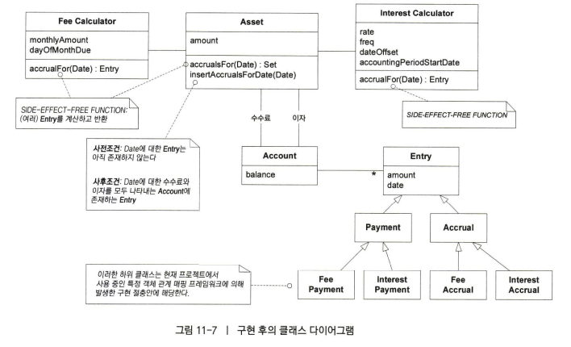

# 11장 분석 패턴의 적용


## 패턴 분류

- **분석패턴 Analysis Pattern**
  - 도메인 내 개념적 문제 해결에 초점. 업무 모델링시 발견되는 공통적 구조 개념의 집합.
- **디자인 패턴 Design Pattern**
  - 일반적인 설계문제 해결, 컴포넌트 사이 구고 서술, 언어나 패러다임에 독립적.
- 이디엄 Idiom
  - 디자인패턴 하위에 위치, 언어에 종속적, 언어의 기능을 사용해 컴포넌트 특정 부분 구현방법을 서술.
- 아키텍처 패턴 Architecture Pattern
  - 전체적인 구조 결정, 미리 정의된 서브시스템 제공, 언어나 프로그래밍 패러다임에 독립적
  - 책 추천
    - [가상 면접 사례로 배우는 대규모 시스템 설계 기초](http://www.yes24.com/Product/Goods/102819435)
    - [대규모 서비스를 지탱하는 기술](http://www.yes24.com/Product/Goods/4667932)

[참고] https://laughcryrepeat.tistory.com/14


## 분석패턴 : 재사용 가능한 객체 모델

```
도메인 문제 관찰 중 익숙한 종류의 책임이나 관계 발견 -> 과거 문제를 해결했던 경험 활용
```

- 실무에서 쌓은 경험을 바탕으로 도출된 것
- 파악하기 힘든 도메인을 다뤄야 하는 사람들에게 가치있는 출발점 제공
- 최상의 분석 패턴은 과거의 프로젝트에서 유용한 경험을 전달하고 모델에 대한 통찰력을 설계와 구현에 결합할 수 있게 한다.
- 패턴의 외견상 형태는 변경해도 무방하지만 **의미**하는 기본 개념은 손대지 말아야 한다.
  - 패턴에는 문제의 발생을 미연에 방지할 수 있는 지식 포함
  - 널리 이해되거나 잘 설명된 용어를 포함시킴으로써 유비쿼터스 언어의 품질 향상


## 예시: 회계 모델

#### 요구사항

- 대출(loan)과 이자부 자산(interest-bearing asset)을 관리하는 애플리케이션
- 발생한 이자(interest)와 수수료(fee)를 계산
- 차용인이 변제한 상환액(payment)를 추적


#### 초기 클래스 다이어그램


- 이자부 자산을 관리 : Asset
  - 현재 잔액(balance)을 관리한다.
- 발생한 이자 계산 : `Interest Calculaotr`
- 발생한 수수료 계산 : `Fee Calculator`
- 차용인이 변제한 **상환액(payment)를 추적** : `Fee Payment History` 와 `Interest Payment History` 를 이용 

---

- 이자 발생 시
  - Interest Calculator에서 이자 계산 -> Asset의 amount 업데이트? -> interestDueAmount 업데이트
- 이자 상환 시  
  - Asset의 amount 업데이트 -> Interest Payment History에 기록
- 수수료 발생 시
  - Fee Calculator에서 이자 계산 -> Asset의 amount 업데이트? -> monthlyAmount 업데이트
- 수수료 상환 시 
  - Asset의 amount 업데이트 -> Fee Payment History에 기록

---

단점

- 수수료와 이자의  **발생 이력은 확인할 수 없다**.
  - 월별 확인, 건별 확인 등 불가
- 이자, 수수료 종류에 따라 다른 인터페이스(`calculateInterestForDate() `, `calculateFeesForDate()`)를 사용하여 계산 처리, 호출등을 해야해서 클라이언트가 도메인에 대해 더 많이 알아야 한다.
- Asset의 용어가 전통적인 회계 도메인에서의 유비쿼터스 언어와 맞지 않다. => Account의 역할을 함께 수행하고 있다.
- Fee Payment History와 Interest Payment History를 **발생**과 관여시킬 수 없고 현재 amount의 히스토리 추적이 어렵다.


#### 회계 분석 패턴


- 모든 종류의 애플리케이션은 **계정(account)**를 관리하며 계정에는 **특정한 값(일반적으로 금액)을 저장**한다.
- 현재 저장된 **총액에 이르기까지의 개별적인 변화를 통제하고 변화의 원인을 설명**할 수 있어야 한다.
  - 값을 추가하려면 Account에 Entry를 추가한다. 
  - 값을 제거하려면 음의 부호를 가진 Entry를 추가한다.
  - Entry 자체를 제거하는 경우는 없으므로 변경 이력이 유지된다.
- 회계의 기본원리는 `보존` 이다. 간단히 하나의 Account에서 다른 Account로 이동할 뿐이다.
  - 모든 대변에 대응되는 차변이 존재한다. (`복식부기`의 기본)
- **같은 Account 내에서도, 발생과 상환으로 보존의 원리가 적용될 수 있다.**


#### 분석 패턴을 반영한 모델



- 수수료, 이자의 **발생** 기록도 **상환** 이력과 동일한 Entry 모델로 다루어 추적을 가능하게 한다.
- 수수료, 이자에 대해 추적하고 관리하는 책임은 Account를 활용한다.
- 잔액(balance)은 모든 Entry의 금액을 합한 총액